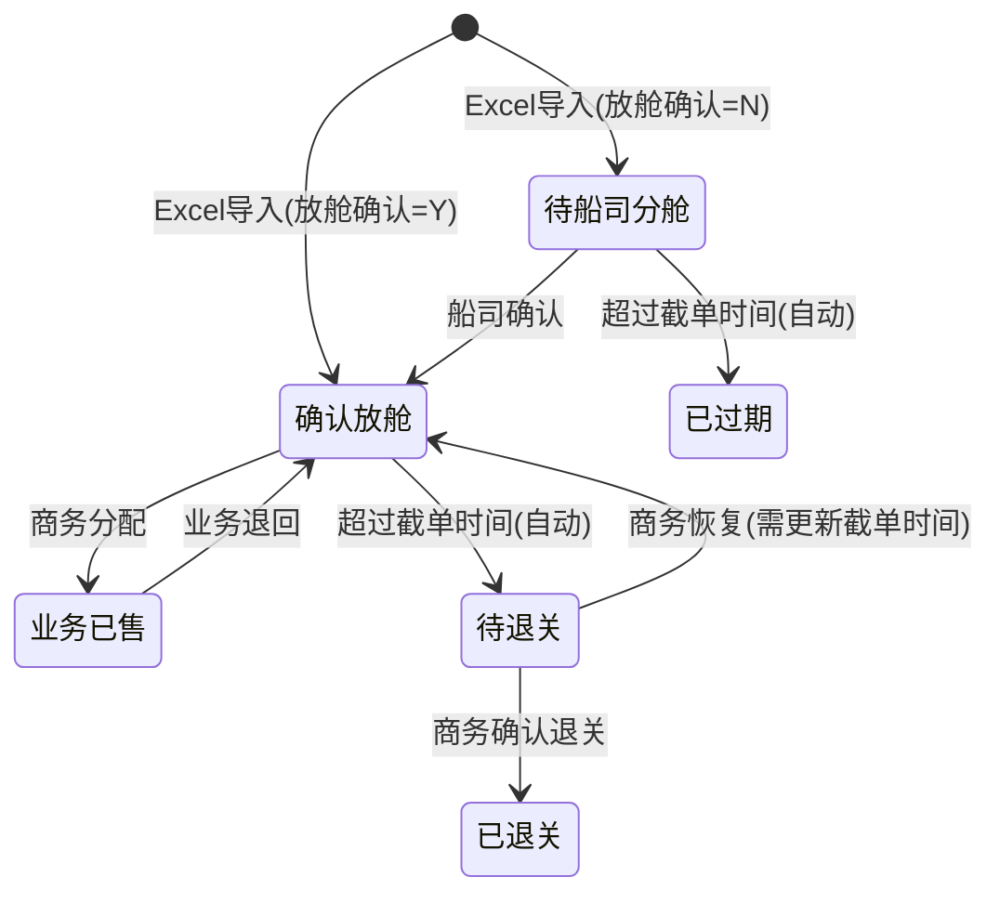
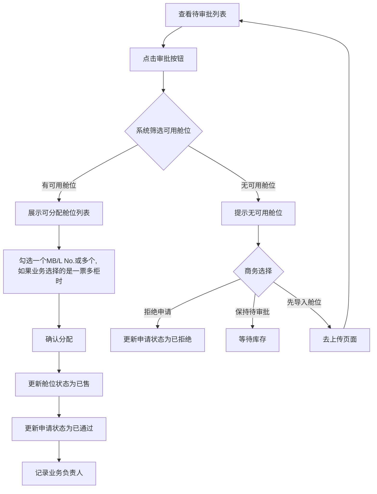

# 货代放舱管理系统 PRD

> **项目名称**：SlotLink
> **原型链接**：https://slotflow-logistics.lovable.app/
> **版本**：v1.1 (MVP)
> **更新日期**：2026-01-10

---

## 1. 系统概述

### 1.1 系统定位

**货代放舱管理系统（SlotLink）** 是一个面向货运代理公司内部的舱位管理工具，用于管理从船司获取的舱位资源，并协调商务与业务人员之间的舱位分配流程。

### 1.2 核心价值

- **提升效率**：将 Excel 手工管理转变为系统化管理
- **流程规范**：建立舱位申请-审批-分配的标准化流程
- **信息透明**：业务可实时查看可用库存，减少沟通成本
- **权限隔离**：商务与业务职责分明，数据权限清晰

### 1.3 技术栈

| 层级 | 技术选型 |
|------|----------|
| 前端 | React 18 + TypeScript + Tailwind CSS + shadcn/ui |
| 后端 | Node.js + Nest.js + TypeScript |
| 数据库 | PostgreSQL |
| ORM | Prisma |
| 认证 | Keycloak (OIDC/JWT) |

### 1.4 非功能性需求

| 项目 | 指标 |
|------|------|
| 并发用户 | <50 人 |
| 页面响应 | <2s |
| Excel 导入 | 单次最大 1000 行 |
| 文件大小 | 最大 10MB |
| 数据保留 | 永久（MVP 不做归档） |

---

## 2. 组织架构与用户模型

### 2.1 组织架构

```
母公司 (Corporation)
├── 子公司A (Company)
│   └── 业务员A1, A2, A3...
├── 子公司B (Company)
│   └── 业务员B1, B2...
└── 子公司C (Company)
    └── 业务员C1, C2...

商务团队 → 独立于子公司，服务所有子公司
管理员 → 系统级别
```

### 2.2 角色定义

| 角色 | 英文标识 | 说明 |
|------|----------|------|
| 管理员 | admin | 系统管理，全部权限 |
| 商务 | commercial | 舱位管理、审批分配，跨子公司共享 |
| 业务 | sales | 库存查看、申请舱位，归属特定子公司 |

### 2.3 权限矩阵

| 功能              | 商务 | 业务 | 管理员 |
|-----------------|------|------|--------|
| 上传舱位            | ✅ | ❌ | ✅ |
| 查看舱位（自己上传）      | ✅ | ❌ | - |
| 查看所有舱位          | ❌ | ❌ | ✅ |
| 编辑舱位（自己上传）      | ✅ | ❌ | ✅ |
| 查看航线库存（自己的）     | ✅ | - | - |
| 查看航线库存（全局）      | - | ✅ | ✅ |
| 申请舱位            | ❌ | ✅ | ✅ |
| 审批申请（自己舱位）      | ✅ | ❌ | - |
| 审批申请（所有）        | ❌ | ❌ | ✅ |
| 查看自己的申请         | ❌ | ✅ | ✅ |
| 撤销/退回舱位         | ❌ | ✅ | ✅ |
| 船司确认放舱          | ✅ | ❌ | ✅ |
| 退关（自己的，待退关状态转化） | ✅ | ❌ | ✅ |
| 用户管理            | ❌ | ❌ | ✅ |
| 公司管理            | ❌ | ❌ | ✅ |

### 2.4 数据权限规则

| 角色 | 舱位可见 | 申请可见 | 库存可见 |
|------|----------|----------|----------|
| 管理员 | 全部 | 全部 | 全部 |
| 商务 | 仅自己上传的 | 仅自己舱位相关的申请 | 仅自己上传的舱位库存 |
| 业务 | 仅分配给自己的 | 仅自己的 | 全局库存（聚合） |

---

## 3. 核心业务流程

### 3.1 主流程概览

```
商务Excel上传 → 船司分舱确认 → 业务员申请 → 商务分配 → 业务完善客户信息
 (待船司分舱)     (确认放舱)    (船名航次+箱型)  (业务已售)
      ↓              ↓              ↓            ↓
  [Excel导入]   [商务更新状态]   [业务申请]   [分配MB/L]

超时未售出 → 待退关(自动) → 已退关(商务操作)
```

### 3.2 舱位状态定义

| 状态 | 颜色 | 触发条件 | 可转换到                    |
|------|------|----------|-------------------------|
| 待船司分舱 | 灰色 | Excel 导入且放舱确认=N/空 | 确认放舱、已过期(超过截单日期自动转换)    |
| 已过期 | 深灰色 | 待船司分舱 + 超过截单时间 | 无(流程结束)                 |
| 确认放舱 | 🟢 绿色 | 船司确认 / 业务退回 | 业务已售、待退关(离截关时间还剩24小时)   |
| 业务已售 | 🔵 蓝色 | 商务分配给业务 | 确认放舱（业务退回）              |
| 待退关 | 🟠 橙色 | 确认放舱 + 超过截单时间 | 已退关、确认放舱: 商务恢复(需更新截单时间) |
| 已退关 | 深灰色 | 商务确认退关 | 无(流程结束)                 |

### 3.3 舱位状态流转图



### 3.4 超时规则

```
规则1：待船司分舱超时
  触发条件：当前时间 > 对外截单时间
  自动动作：状态变为「已过期」

规则2：确认放舱超时
  触发条件：当前时间 + 24小时 >= 对外截单时间
  自动动作：状态变为「待退关」

规则3：业务已售不触发超时
  说明：已分配给业务的舱位不受超时规则影响
  原因：舱位已进入业务跟进流程，状态由业务操作决定

触发机制：系统定时任务，每小时执行一次
```

### 3.5 恢复操作规则

```
规则1：恢复操作必须更新截单时间
  适用状态：待退关 → 确认放舱
  强制要求：新的截单时间必须 > 当前时间 + 24小时
  原因：避免恢复后立即触发超时，形成无意义循环

规则2：恢复操作权限
  商务：仅能恢复自己上传的舱位
  管理员：可恢复所有舱位

规则3：恢复后状态
  舱位状态：变为「确认放舱」
  原申请单：不受影响（已拒绝/已撤销的申请不会自动恢复）
  业务员：需重新申请
```

### 3.6 申请生命周期管理

```
规则1：申请不自动关闭
  说明：即使关联航线的舱位全部过期/退关，待审批申请仍保持待审批状态
  处理：由商务手动拒绝或等待新库存

规则2：建议的人工处理机制
  商务应定期检查待审批列表
  对于关联航线已无可用库存的申请，建议及时加订舱位并导入系统, 导入后再审批
  也可以直接拒绝, 拒绝理由可填写"航线已无可用舱位"
```

---

## 4. 功能模块详解

### 4.1 系统模块概览

| 模块 | 子功能 | 目标用户 |
|------|--------|----------|
| **用户认证** | 登录/登出 | 全体用户 |
| **公司管理** | 公司增删改查 | 管理员 |
| **用户管理** | 用户增删改查、角色分配 | 管理员 |
| **舱位管理** | Excel批量上传、舱位列表查看、舱位信息编辑、状态管理 | 商务 |
| **库存查询** | 航线库存查看、我的申请记录、已分配舱位 | 业务 |
| **申请审批** | 提交申请、审批处理、申请撤销、舱位退回 | 商务+业务 |
| **自动化管理** | 自动退关检测、自动过期检测 | 系统 |

---

### 4.2 商务：批量上传舱位

**功能目的**：将船司提供的 Excel 舱位信息批量导入系统

#### 4.2.1 基本规则

- 文件格式：`.xls`, `.xlsx`，大小 ≤10MB
- 必填字段：`MB/L No.`（唯一标识）、船名航次、箱型、对外截单时间
- 状态映射：
  - `放舱确认 = Y` → **确认放舱**
  - `放舱确认 = N/空` → **待船司分舱**

#### 4.2.2 重复处理规则

| 场景 | 处理方式                           |
|------|--------------------------------|
| MB/L 不存在 | **跳过，不导入**                     |
| MB/L 已存在（同一商务上传） | **跳过，不更新**                     |
| MB/L 已存在（其他商务上传） | **跳过，不更新**，提示"该 MB/L 已被其他商务上传" |

**MB/L 归属规则**：
- 每个 MB/L 只能归属于**首次上传的商务**
- 其他商务上传相同 MB/L 时无效，系统会跳过并提示
- 管理员上传的 MB/L 同样遵循此规则
- 此规则确保舱位责任归属明确，避免多人重复管理同一舱位

#### 4.2.3 事务处理

```
规则：部分行失败时，全部回滚
流程：
  1. 导入前进行预校验, 包括: 必填项检测
  2. 校验失败时展示所有错误行及原因
  3. 用户修正后重新上传
```

#### 4.2.4 导入结果展示

成功时：
```
✅ 导入成功
- 新增舱位：28 条
- 跳过重复（自己已上传）：3 条（MB/L: xxx, xxx, xxx）
- 跳过重复（其他商务已上传）：2 条（MB/L: yyy, yyy）
```

失败时：
```
❌ 导入失败，已全部回滚
错误明细：
- 第3行：MB/L No. 为空
- 第7行：对外截单时间格式错误
- 第12行：箱型不在允许范围内
```

#### 4.2.5 保留字段列表

| 字段名      | 说明                | 必填 |
|----------|-------------------|------|
| MB/L No. | 舱位唯一标识            | ✅ |
| 船名航次     | 航线标识              | ✅ |
| 启运港      | 启运港               | ✅ |
| 目的港      | 目的港               | ✅ |
| 舱位来源     | 舱位供应商             | ✅ |
| 合约号      | 合约号               | ✅ |
| 舱位状态     | 舱位供应商是否确认放舱       | ✅ |
| 箱型箱量     | 如 1X40'HC、1X20'GP | ✅ |
| 对外截单时间   | 业务截止时间            | ✅ |
| 预计开航     | ETD               |✅  |
| 船司       | 如 EVG、MSC         | ✅ |
| 单海运成本    | 起运港               | |
| 价格有效期开始  | 价格有效期开始           | |
| 价格有效期结束  | 价格有效期结束           | |
| 卸货港      | 目的港               | |
| 中转港      |                   | |
| 截放行日期    |                   | |
| 码头       | 如梅山码头             | |
| 作业号      | 作业号               | |

---

### 4.3 商务：舱位列表与编辑

**筛选条件**：
- 船名航次
- 箱型（下拉选择）
- 状态（多选：待船司分舱、确认放舱、业务已售、待退关、已退关、已过期）
- 截单时间范围

**权限控制**：
- 查看权限：商务仅能查看自己上传的舱位
- 编辑权限：商务仅能编辑自己上传的舱位
- 管理员可查看和编辑所有舱位

---

### 4.4 业务：查看航线库存

**功能特点**：
- 展示航线级别的聚合库存数据（按船名航次+箱型分组）
- **不展示具体 MB/L No.**
- 库存为 0 时仍可提交申请
- 即将截单（3天内）的航线高亮提示

**库存计算规则**：
- 库存 = 「确认放舱」状态的舱位数量
- 不包含「待船司分舱」「待退关」等其他状态

**库存卡片示例**：
```
┌─────────────────────────────────────────────────────┐
│  EVER FOND V.1246E                                  │
│  船司: EVG  |  预计开航: 2026-01-01                  │
│  目的港: SAVANNAH,GA  |  对外截单: 2026-01-01 17:00  │
│                                                     │
│  箱型库存:                                          │
│  ┌───────────────────────────────────────────┐     │
│  │  1X40'HC     15个    [申请舱位]           │     │
│  │  1X20'GP      8个    [申请舱位]           │     │
│  │  2X40'HC      0个    [申请舱位]  库存为0  │     │
│  └───────────────────────────────────────────┘     │
└─────────────────────────────────────────────────────┘
```

---

### 4.5 业务：申请舱位

**申请信息**（MVP 版本）：
- 船名航次（自动填充）
- 箱型（自动填充）
- 申请人、申请时间（系统记录）

**申请规则**：
- 同一航次同一箱型**可重复申请**（如对应多个客户）
- 提单类型 单选: 一票一柜、一票多柜
- 一票多柜的情况下,需要输入柜量, 默认“1个”
- 启运港需要选择or填入
- 目的港需要选择or填入
- 库存为 0 时也可申请（等待商务处理）
- 申请单初始状态：**待审批**

**预留扩展字段**（后续版本）：
- 客户名称
- 货物信息
- 特殊要求
- 预计装箱量

---

### 4.6 业务：申请记录管理

#### 4.6.1 申请状态定义

| 状态 | 说明 | 可操作 |
|------|------|--------|
| 待审批 | 等待商务处理 | 业务可撤销 |
| 已通过 | 商务已分配舱位，业务当前持有 | 业务可退回舱位 |
| 已拒绝 | 商务拒绝申请 | 仅查看 |
| 已撤销 | 业务主动撤销 | 仅查看 |
| 已退回 | 业务退回舱位后的状态 | 仅查看 |

#### 4.6.2 退回舱位操作

- 舱位状态：业务已售 → 确认放舱
- 业务负责人字段清空
- 申请单状态：已通过 → **已退回**

---

### 4.7 商务：审批申请

#### 4.7.1 审批流程



#### 4.7.2 业务规则

- **分配顺序**：商务自由选择，不强制先到先得
- **零库存申请**：商务可选择拒绝或保持待审批等待库存
- **拒绝理由**：选填，不强制
- **申请过期处理**：即使关联航线的舱位全部过期/退关，待审批申请仍保持待审批状态，由商务手动拒绝或等待新库存

#### 4.7.3 审批界面关键信息

- 申请信息：业务员、船名航次、箱型、申请时间
- 可分配舱位列表：展示具体 MB/L No.、启运港、目的港
- 操作按钮：确认分配 / 拒绝申请

---

## 5. 数据模型设计

### 5.1 公司表 (Company)

```sql
- id (PK)
- name - 公司名称
- code - 公司编码
- parent_id - 父公司ID（可选，支持母子公司）
- status - 状态（启用/禁用）
- created_at, updated_at
```

### 5.2 用户表 (User)

```sql
- id (PK)
- username - 用户名
- password_hash - 密码哈希
- name - 姓名
- role - 角色枚举 (admin, commercial, sales)
- company_id - 所属公司ID（商务可为空，表示全局）
- status - 状态（启用/禁用）
- created_at, updated_at
```

### 5.3 舱位表 (Slot)

```sql
- id (PK)
- mbl_no (UK) - MB/L号，唯一标识
- vessel_voyage - 船名航次
- container_type - 箱型
- teu - 标准箱数量
- gross_weight - 毛重
- etd - 预计开航
- cutoff_time - 对外截单时间
- pod - 卸货港
- pol - 交货地
- trans_port - 中转港
- terminal - 码头
- carrier - 船司
- status - 状态枚举 (pending_carrier, expired, confirmed, sold, pending_return, returned)
- uploaded_by - 上传人
- assigned_to - 分配给（业务）
- created_at, updated_at
```

### 5.4 申请表 (Application)

```sql
- id (PK)
- vessel_voyage - 船名航次
- container_type - 箱型
- applicant_id - 申请人
- status - 申请状态枚举 (pending, approved, rejected, cancelled, returned)
- slot_id - 分配的舱位（通过后填充）
- processed_by - 审批人
- processed_at - 审批时间
- rejection_reason - 拒绝原因（选填）
- returned_at - 退回时间
- created_at, updated_at
```

---

## 6. 接口设计

### 6.1 接口列表

| 接口 | 方法 | 说明 |
|------|------|------|
| `/auth/login` | POST | 用户登录 |
| `/auth/logout` | POST | 用户登出 |
| `/auth/me` | GET | 获取当前登录用户信息 |
| `/users` | GET/POST | 用户管理 |
| `/users/:id` | GET/PUT/DELETE | 用户详情/更新/删除 |
| `/companies` | GET/POST | 公司管理 |
| `/companies/:id` | GET/PUT/DELETE | 公司详情/更新/删除 |
| `/slots/upload` | POST | 批量上传舱位 |
| `/slots` | GET | 获取舱位列表（支持筛选） |
| `/slots/:id` | GET/PUT | 舱位详情/更新 |
| `/slots/:id/confirm` | POST | 商务确认船司放舱（待船司分舱→确认放舱） |
| `/slots/:id/restore` | POST | 恢复舱位（已过期/待退关/已退关→确认放舱），**必须传入新截单时间** |
| `/slots/:id/return-confirm` | POST | 商务确认退关（待退关→已退关） |
| `/inventory` | GET | 获取航线库存聚合数据 |
| `/applications` | GET/POST | 获取申请列表/提交申请 |
| `/applications/:id` | GET | 申请详情 |
| `/applications/:id/approve` | POST | 审批通过 |
| `/applications/:id/reject` | POST | 拒绝申请 |
| `/applications/:id/cancel` | POST | 撤销申请 |
| `/applications/:id/return` | POST | 退回舱位 |

### 6.2 接口权限矩阵

| 接口 | 商务 | 业务 | 管理员 | 数据范围说明 |
|------|------|------|--------|-------------|
| 登录/登出 | ✅ | ✅ | ✅ | - |
| 上传舱位 | ✅ | ❌ | ✅ | - |
| 查看舱位列表 | ✅ | ❌ | ✅ | 商务仅自己上传的，管理员全部 |
| 查看库存 | ✅ | ✅ | ✅ | 商务仅自己的，业务/管理员全局 |
| 提交申请 | ❌ | ✅ | ✅ | - |
| 审批申请 | ✅ | ❌ | ✅ | 商务仅自己舱位的申请，管理员全部 |
| 恢复舱位 | ✅ | ❌ | ✅ | 商务仅自己上传的，管理员全部 |
| 用户管理 | ❌ | ❌ | ✅ | - |
| 公司管理 | ❌ | ❌ | ✅ | - |

---

## 7. 页面原型概要

### 7.1 首页（商务视图）

- 今日概况：今日新增舱位、待审批申请、即将截单航线
- 舱位分布：按状态统计饼图
- 快捷入口：上传舱位、审批申请、舱位列表

### 7.2 首页（业务视图）

- 申请概况：我的申请统计
- 热门航线：近期可用航线卡片
- 库存展示：各箱型库存数量
- 待审批列表：我的待处理申请

### 7.3 舱位列表页（商务）

- 筛选区：船名航次、箱型、状态、截单时间、上传商务
- 列表区：MB/L No.、船名航次、箱型、截单时间、状态、操作
- 操作：编辑

### 7.4 审批弹窗（商务）

- 申请信息展示
- 可分配舱位列表（单选）
- 确认分配 / 拒绝申请

---

## 8. 风险与应对

### 8.1 潜在风险

| 风险 | 影响 | 应对措施 |
|------|------|----------|
| 并发冲突 | 多个商务同时审批同一航线的申请，可能导致库存超售 | 审批时对舱位加乐观锁 |
| 数据一致性 | 舱位状态与申请状态不同步 | 使用数据库事务保证 |
| Excel解析失败 | 不同格式的Excel可能导致解析失败 | 提供标准模板下载，预校验 |
| 恢复后立即超时 | 恢复舱位时截单时间已过，会立即再次触发超时 | **强制要求恢复时更新截单时间，且新时间必须 > 当前时间** |
| MB/L 归属冲突 | 多个商务可能上传相同的 MB/L | **MB/L 仅归属首次上传的商务，其他商务上传无效** |
| 待审批申请堆积 | 关联航线无库存的申请不会自动关闭 | 商务应定期手动处理，后续版本考虑增加自动过期机制 |
| 业务已售舱位无超时 | 业务拿到舱位不跟进，造成"僵尸舱位" | MVP 暂不处理，后续版本可增加超期提醒 |

### 8.2 MVP 范围排除

以下功能不在 MVP 范围内，后续迭代：
- ❌ 通知功能（站内消息、邮件、微信）
- ❌ 数据导出（Excel 导出）
- ❌ 操作日志/审计追溯
- ❌ 批量审批
- ❌ 数据统计报表

---

## 9. 实施计划

### Phase 1 - MVP 核心流程（当前）

1. 用户认证（登录/登出）
2. 公司和用户管理
3. Excel 批量上传舱位
4. 舱位列表查看与筛选
5. 库存聚合查询
6. 申请提交与管理
7. 审批与分配
8. 定时任务（超时状态变更）

### Phase 2 - 体验优化

- 通知功能
- 数据导出
- 批量审批
- 操作日志

### Phase 3 - 数据分析

- 统计报表
- 数据看板

---

## 10. 验证清单

完成开发后，需验证以下核心场景：

**上传与导入**：
- [ ] 商务可以上传 Excel 并正确解析
- [ ] 重复 MB/L（自己上传）被正确跳过
- [ ] 重复 MB/L（其他商务上传）被跳过并提示"已被其他商务上传"
- [ ] 部分行错误时全部回滚
- [ ] MB/L 归属于首次上传的商务

**库存与申请**：
- [ ] 业务可以看到聚合库存
- [ ] 业务可以提交申请
- [ ] 商务可以看到所有待审批申请
- [ ] 商务可以分配舱位给业务
- [ ] 业务可以退回舱位，申请变为已退回

**状态流转与超时**：
- [ ] 超过截单时间的舱位自动变为待退关
- [ ] 待船司分舱超时自动变为已过期
- [ ] 商务可以恢复已退关的舱位（需更新截单时间）
- [ ] 商务可以恢复已过期的舱位（需更新截单时间）
- [ ] 商务可以恢复待退关的舱位（需更新截单时间）
- [ ] 恢复时截单时间必须大于当前时间，否则拒绝操作

**权限隔离**：
- [ ] 不同子公司的业务员数据相互隔离
- [ ] 商务只能看到/操作自己上传的舱位
- [ ] 商务无法恢复其他商务上传的舱位

---

## 附录：术语表

| 术语 | 英文 | 说明 |
|------|------|------|
| MB/L | Master Bill of Lading | 主提单，舱位唯一标识 |
| TEU | Twenty-foot Equivalent Unit | 二十英尺标准集装箱 |
| ETD | Estimated Time of Departure | 预计开航时间 |
| POD | Port of Discharge | 卸货港 |
| POL | Port of Loading | 装货港 |
| 箱型 | Container Type | 如 1X40'HC（一个40英尺高柜） |
